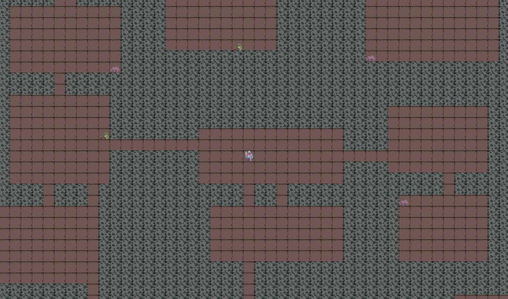
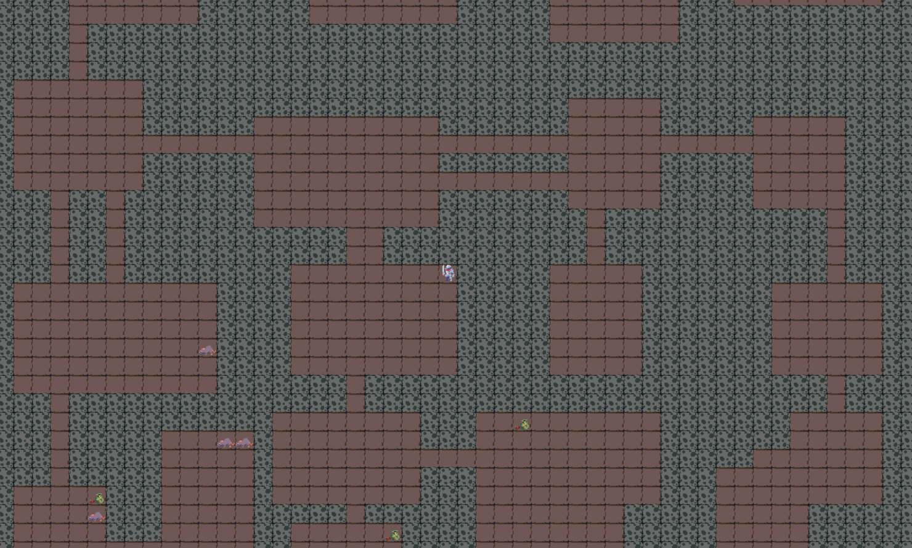

# roguelike-game

A Godot 4 tech demo exploring procedural dungeon generation and enemy AI. This is not a complete game — it's a focused showcase of two core systems: **BSP-based dungeon generation** and **Manhattan heuristic pathfinding**.

---

## Features

### Dungeon Generation (BSP Binary Tree)
The dungeon is procedurally generated using a **Binary Space Partitioning (BSP)** tree algorithm:

1. The map starts as a single large rectangular region.
2. The region is recursively split — alternating between horizontal and vertical cuts — until each partition reaches a minimum size.
3. A room is carved out inside each leaf partition, with randomized size and position within its bounds.
4. Corridors are drawn between sibling rooms, connecting the full tree back up from leaves to root.

This guarantees a fully connected dungeon with no isolated rooms on every run.

### Enemy AI (Manhattan Heuristic Pathfinding)
Enemies navigate toward the player using a **Manhattan distance heuristic**:

- Each enemy evaluates neighboring tiles and moves toward whichever reduces Manhattan distance to the player the most.
- Manhattan distance: `|Δx| + |Δy|` — no diagonals, grid-accurate.
- Enemies do not path through walls.
- The player can kill enemies by moving into them.

---

## How to Run

1. Clone the repository:
   ```bash
   git clone https://github.com/LECahill/roguelike-game.git
   ```
2. Open the project in **Godot 4.x**.
3. Run the main scene.

A new dungeon is generated each time you launch.

---

## Controls

| Key | Action |
|-----|--------|
| `W A S D` | Move player |

Moving into an enemy kills it.

---

## Project Structure

```
roguelike-game/
├── scenes/                  # Godot scenes
├── scripts/                 # GDScript files
│   ├── dungeon_manager.gd   # BSP dungeon generation and room/corridor placement
│   ├── enemy.gd             # Enemy pathfinding and combat logic
│   ├── player.gd            # Player movement and input
│   ├── tile_map_layer.gd    # Tilemap rendering and grid management
│   └── turn_manager.gd      # Turn order and game loop management
└── README.md
```

---

## What This Is (and Isn't)

This project is a **technical demonstration**, not a finished game. The goal was to implement and understand:

- How BSP trees can reliably produce varied, fully-connected dungeon layouts
- How a simple Manhattan heuristic can drive convincing enemy pursuit behavior without a full A* implementation

There is no win condition, UI, or progression system — just the systems themselves running in a playable sandbox.

---

## Built With

- [Godot 4](https://godotengine.org/) — Game engine
- GDScript — Scripting language

---

## Screenshots




## Dungeon Generation


